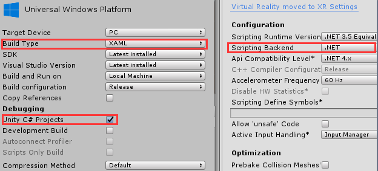
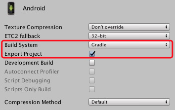

# Unity plugin for AdDeals

This is a cross-platform Unity plugin for [AdDeals](https://www.addealsnetwork.com/)'s SDKs. It combines and supports three platforms together: Windows(UWP), iOS, and Android.

System requirements:

* Unity v5.5.4.p5 or later
* Vistual Studio 2017 or later
* Xcode 10
* Android Studio 3.2.1


## Integrate

* In order to get your AppID  & AppKey you must first create an account on http://www.addealsnetwork.com
* Then add your iOS / Android / Windows 10 apps and you will get 1 AppID / AppKey for each app version.
* <font color=#FF0000>Download</font> the AdDeals plugin from either [Unity Asset Store](http://u3d.as/1p2y), or [SDKBox repo](https://github.com/sdkbox/AdDeals-Unity-Plugin/).
* Drag `Assets\AdDeals\AdDeals.prefab` onto your game scene.
* Call AdDeals SDK APIs. Please check out the sample codes in `Assets\AdDeals\Sample\Test.cs`:
```
AdDeals.AdDealsWrapper.Init("AppID", "AppKey");

int adType = AdDealsWrapper.AdTypeInterstitial; // 1:interstitial 2: reward
AdDeals.AdDealsWrapper.ShowAd(adType);
```


### Windows UWP build

* Support the lastest AdDeals SDK for Windows:  [AdDealsUniversalSDKW81](https://www.nuget.org/packages/AdDealsUniversalSDKW81).
* Using .Net ScriptBackend, please export the UWP <font color=#FF0000>project (project)</font> in Unity with the following settings:

    

* Please enable `InternetClient` setting for UWP under `PlayerSetting`->`Universal Windows Platform`->`Publishing Setting`->`Capabilities`

    

* For Unity 5.x: if you want to build UWP application, please use Unity 5.5.4p5 or later. you can download [Unity Patch Releases](https://unity3d.com/unity/qa/patch-releases).


### iOS build

* From Unity, first export to an iOS project. Next build and run it using Xcode.
* Support iOS 8+.


### Android build

* From Unity, first export the application to a Gradle project. Next build and run it using Android Studio. __Do NOT build APK directly in Unity.__

    

* Support Android SDK v15+.
* For Unity 5.x: please edit `YOUR_EXPORTS_PROTECT_ROOT/build.gradle` with the following configurations:
```gradle
    ...
    android {
        ...
        defaultConfig {
            minSdkVersion 15
            targetSdkVersion 28
            versionCode 1
            versionName '0.1'
            ...
        }
        ...
    }
    ...
```


## API

### Methods


* Initialize the AdDeals SDK.

```
void AdDeals.AdDealsWrapper.Init(String appID, String appKey);
```

* Set privacy policy consent.

```
void AdDeals.AdDealsWrapper.SetConsent(int consent);
```

* Check availability.
* `uiOrientation` is invalid on UWP. Set to `AdDealsWrapper.UIOrientationUnknown`.

```
void AdDeals.AdDealsWrapper.CheckAvailable(int adType, int uiOrientation);
```

* Cache Ad.
* `placementID` in most cases just leave it "".
* `uiOrientation` is invalid on UWP, set to `AdDealsWrapper.UIOrientationUnknown`.

```
void AdDeals.AdDealsWrapper.CacheAd(int adType, string placementID, int uiOrientation);
```

* Show Ad.
* `placementID` in most cases just leave it "".
* `uiOrientation` is invalid on UWP, set to `AdDealsWrapper.UIOrientationUnknown`.

```
void AdDeals.AdDealsWrapper.ShowAd(int adType, string placementID, int uiOrientation);
```

__Note__: placementID is an advanced feature and in most cases you can just leave it "". In case you want to use placementIDs you should contact addeals@ahead-solutions.com

### Callback

SDK trigers feedback events (callbacks) notifying the client app when action are performed (either by SDK or end user; typically when there is an ad being shown/clicked/closed) or when failures occur. Following is the exhaustive listing of exposed callbacks :

```
public static event AdAvailableHandler AdAvailableEvent;
public static event AdEventHandler SDKNotInitializedEvent;
public static event AdEventHandler ShowAdVideoRewardGrantedEvent;
public static event AdEventHandler ShowAdSucessEvent;
public static event AdEventStringHandler ShowAdFailedEvent;
public static event AdEventHandler CacheAdSuccessEvent;
public static event AdEventStringHandler CacheAdFailedEvent;
public static event AdEventHandler MinDelayBtwAdsNotReachedEvent;
public static event AdEventHandler AdClosedTap;
public static event AdEventHandler AdClickedTap;
public static event AdEventHandler AdManagerInitSDKSuccess;
public static event AdEventStringHandler AdManagerInitSDKFailed;
public static event AdEventHandler AdManagerConsentSuccess;
public static event AdEventStringHandler AdManagerConsentFailed;
public static event AdEventHandler AdManagerAppDownloadSourceDetected;
public static event AdEventHandler AdManagerAppSessionSourceDetected;
```

here is a sample to subscribe SDK init success:

* define a function
```
void AdManagerInitSDKSuccess() {
    //addeals init success
}
```

* let the upper function subscribe SDK init success event
```
AdDeals.AdDealsWrapper.AdManagerInitSDKSuccess += AdManagerInitSDKSuccess;
```

* when sdk init success, AdManagerInitSDKSuccess will be called.

### Constants

#### UI Orientation
```
AdDealsWrapper.UIOrientationUnknown;
AdDealsWrapper.UIOrientationPortrait;
AdDealsWrapper.UIOrientationLandscape;
```

#### Ad type
```
AdDealsWrapper.AdTypeInterstitial;
AdDealsWrapper.AdTypeRewardVideo;
```

#### Consent
```
public const int UserConsentNotApplicable;     // iOS:AdDealsUserConsentNotApplicable:-1 Android:NOT_ELIGIBLE:2
public const int UserConsentRevoke;             // iOS:AdDealsUserConsentRevoke:0 Android:DISAGREE:1
public const int UserConsentGrant;              // iOS:AdDealsUserConsentGrant:1 Android:APPROVE:0
public const int UserConsentNotSet;             // iOS:AdDealsUserConsentNotApplicable:-1 Android:NOT_SET:3
```


## Verification

Tested on the follow Unity versions:

* Unity v2018.2.16f
* Unity v2018.1.0f2
* Unity v2017.1.2f1
* Unity v2017.1.0p5
* Unity v5.5.4p5


## Sample Project

[https://github.com/sdkbox/AdDeals-Unity-Sample](https://github.com/sdkbox/AdDeals-Unity-Sample)


## Issues

* if you got follow error when import this unitypackage, it's ok, you can ignore it.


